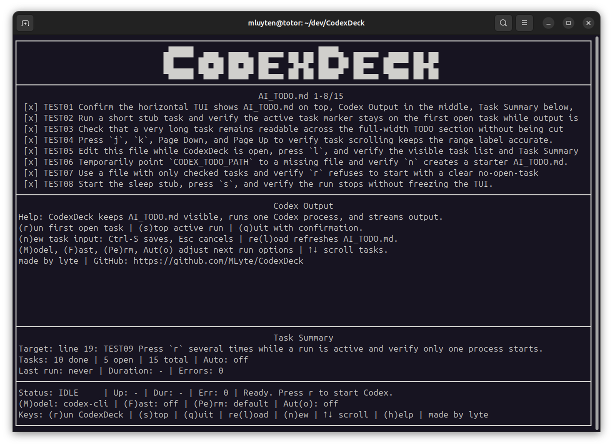

# CodexDeck

## English

CodexDeck is a local terminal cockpit for running one Codex process against an
`AI_TODO.md` work plan.

Its job is simple: keep the plan visible, stream Codex output live, and expose
the controls needed to guide one local Codex run without leaving the terminal.



```text
+--------------------------------------------------------------------------+
|                              AI_TODO.md 1-2/2                            |
| >[ ] First task to run                                                   |
|  [ ] Next task                                                           |
+--------------------------------------------------------------------------+
|                              Codex Output                                |
| Run started. Codex is processing AI_TODO.md.                             |
| Codex output: Reading files...                                           |
+--------------------------------------------------------------------------+
|                              Task Summary                                |
| Target: line 1: First task to run                                        |
| Tasks: 0 done | 2 open | 2 total                                         |
| Last run: 21:42:10 | Duration: 12s | Errors: 0                           |
+--------------------------------------------------------------------------+
| Status: RUNNING | Up: 12s | Dur: - | Err: 0 | [|] Codex is running ...  |
| (M)odel: gpt-5.5 | (F)ast: off | (Pe)rm: default | Aut(o): off       |
| Keys: (r)un CodexDeck | (s)top | (q)uit | (e)dit | lo(g) | v0.0.0 | MIT |
+--------------------------------------------------------------------------+
```

### What CodexDeck Does

**Plan visibility**

- Reads and parses `AI_TODO.md`.
- Highlights the first unchecked task as the current target.
- Keeps long Markdown task lists scrollable with arrow keys and Page Up/Page Down.
- Reloads the TODO file manually with `l` or automatically when the file changes.
- Opens `AI_TODO.md` in `nano` with `e`, then returns to CodexDeck after save or cancel.
- Opens a typed task input with `n`; `Ctrl-S` saves it and `Esc` cancels.
- Creates `AI_TODO.md` automatically when saving the first typed task.

**Codex control**

- Starts one Codex process with `r`.
- Prevents concurrent runs.
- Stops the active process with `s`.
- Shows live Codex output in the terminal.
- Tracks run state, uptime, duration, and error count.
- Uses an alternate terminal screen so CodexDeck feels like a terminal app.
- Restores the terminal when quitting.

**Run options**

- Cycles model labels with `m`.
- Toggles fast mode with `f`.
- Cycles permission labels with `p`.
- Toggles automatic mode with `o`.
- Shows option state in the footer: `Model`, `Fast`, `Perm`, `Auto`.
- Supports command placeholders so these options can be wired into `CODEX_CMD`.

**Automatic mode**

Automatic mode is conservative. When `Auto` is on, CodexDeck starts another run
only after the current process exits successfully and the first open task in
`AI_TODO.md` has changed. If Codex finishes but leaves the same task unchecked,
CodexDeck pauses automatic mode instead of looping forever.

CodexDeck does not mark tasks done itself. The Codex run must update
`AI_TODO.md`.

**Logs and feedback**

- Keeps live logs in memory.
- Writes process logs to `logs/agent.log`.
- Writes user-facing events to `logs/user.log`.
- Appends a readable Markdown summary of completed runs to `CODEX_RUNS.md`.
- Shows the current app version and `MIT` in the footer.
- Sanitizes sensitive-looking log fragments.
- Decodes batched POSIX arrow keys so repeated scrolling does not flood logs
  with ignored escape fragments.
- Shows `Press h for help` instead of duplicating all shortcuts in the output.
- Shows detailed help in the output panel with a short app summary, grouped commands, and the GitHub link.
- The `made by lyte` credit is linked in the help view: `https://github.com/MLyte/CodexDeck`.

### Controls

The footer keeps the main shortcuts visible in one mnemonic line.

- `(r)un CodexDeck`: start the current run.
- `(s)top`: ask for confirmation, then stop the active run.
- `(q)uit`: ask for quit confirmation.
- `(e)dit`: open `AI_TODO.md` in `nano`, then return to CodexDeck.
- `lo(g)`: open `CODEX_RUNS.md`, the Markdown summary of completed Codex runs.
- `re(l)oad`: reload `AI_TODO.md`.
- `(n)ew`: type a new task, then press `Ctrl-S` to save.
- `(m)odel`: cycle configured model labels.
- `(f)ast`: toggle fast mode.
- `(p)erms`: cycle permission labels.
- `aut(o)`: toggle automatic mode.
- `↑↓ scroll`: move through the task list.
- `Page Up` / `Page Down`: scroll by one visible page.
- `(h)elp` or `?`: toggle the detailed help view in the output panel.

### Configuration

CodexDeck reads `codexdeck.conf` from the project root when present, then applies
environment variable overrides. The config format is one `KEY=VALUE` pair per
line. Empty lines and `#` comments are ignored.

Main settings:

- `CODEX_CMD`: command used to start Codex. Default: `codex {todo}`.
- `CODEX_MODEL`: model label shown in CodexDeck. Default: `gpt-5.5`.
- `CODEX_MODELS`: comma-separated labels cycled by `m`.
- `CODEX_FAST_MODEL`: model label used when fast mode is on.
- `CODEX_PERMISSION`: current permission label.
- `CODEX_PERMISSIONS`: comma-separated labels cycled by `p`.
- `RUN_TIMEOUT_SECONDS`: maximum run duration before controlled stop.
- `STOP_TIMEOUT_SECONDS`: stop escalation delay.
- `STATE_REFRESH_HZ`: UI refresh rate.
- `MAX_LOG_LINES`: max in-memory log lines.
- `CODEX_TODO_PATH` or `TODO_PATH`: TODO file path. Default: `AI_TODO.md`.
- `CODEX_LOG_PATH` or `LOG_PATH`: process log path. Default: `logs/agent.log`.
- `CODEX_USER_LOG_PATH` or `USER_LOG_PATH`: user event log path. Default: `logs/user.log`.
- `CODEX_CONFIG_PATH`: alternate config file path.
- `CODEXDECK_EDITOR`: terminal editor command used by `e` and `g`. Default: `nano`.
- `CODEX_ASCII_BORDERS=1`: force ASCII borders.

Supported command placeholders:

- `{todo}`: resolved TODO file path.
- `{model}`: current effective model.
- `{permission}`: current permission label.
- `{fast}`: `1` when fast mode is on, otherwise `0`.

The Codex launch prompt in `CODEX_CMD` should stay English because it is sent
directly to the model.

Example:

```text
CODEX_CMD=codex exec --model {model} --sandbox {permission} "You are launched by CodexDeck. Read {todo}. Work only on the first unchecked task."
CODEX_MODELS=gpt-5.5,gpt-5.4,gpt-5.4-mini,gpt-5.3-codex,gpt-5.3-codex-spark,gpt-5.2
CODEX_FAST_MODEL=gpt-5.3-codex-spark
CODEX_PERMISSIONS=read-only,workspace-write,danger-full-access
CODEX_USER_LOG_PATH=logs/user.log
```

### Run Locally

Requirement: Python 3.9+.

```bash
python3 -m pip install -r requirements.txt
python3 -m codexdeck
```

Install with `pipx`:

```bash
pipx install .
pipx install git+https://github.com/MLyte/CodexDeck.git
```

Print resolved configuration:

```bash
python3 -m codexdeck --print-config
```

Compatibility entrypoints:

```bash
python3 codexdeck.py
python3 agent-cockpit.py
```

Stub run without the real Codex CLI:

```bash
CODEX_CMD="python3 tests/stubs/codex_stub.py --mode success {todo}" python3 -m codexdeck
```

### Project Structure

- `codexdeck.py`: official `python -m codexdeck` entrypoint.
- `agent-cockpit.py`: current CodexDeck app implementation.
- `codexdeck_core.py`: config loading, TODO parser, command helper, state primitives.
- `codexdeck_runner.py`: process lifecycle, run metrics, log buffer, persistent logs.
- `codexdeck_ui.py`: pure terminal frame rendering and compact mode.
- `AI_TODO.md`: project backlog and implementation checklist.
- `tests/stubs/codex_stub.py`: local Codex substitute for smoke tests.

### Tests

```bash
python3 -m pytest tests/unit -q
python3 -m pytest tests/integration -q
python3 -m pytest tests/smoke -q
python3 -m pytest -q
```

PowerShell:

```powershell
powershell -ExecutionPolicy Bypass -File scripts\test.ps1
powershell -ExecutionPolicy Bypass -File scripts\smoke.ps1
powershell -ExecutionPolicy Bypass -File scripts\dev.ps1
```

### Current Limits

- One Codex process only; no multi-agent or parallel execution.
- Automatic mode depends on Codex updating `AI_TODO.md`.
- `n` supports single-line task entry only; use `e` to edit the full TODO file in `nano`.
- No detailed per-task completion report yet.
- No visual diff when `AI_TODO.md` changes.
- No log search, replay, or rotation.
- Wide-character layout handling is still basic.
- Cross-platform keyboard behavior needs broader terminal validation.

---

## Français

CodexDeck est un cockpit terminal local pour lancer un processus Codex à partir
d'un plan de travail `AI_TODO.md`.

Son rôle est simple : garder le plan visible, afficher la sortie Codex en direct
et fournir les contrôles nécessaires pour piloter un run Codex local sans quitter
le terminal.

### Ce Que Fait CodexDeck

**Visibilité du plan**

- Lit et parse `AI_TODO.md`.
- Met en évidence la première tâche non cochée.
- Permet de scroller les longues listes Markdown avec les flèches et Page Up/Page Down.
- Recharge le TODO avec `l` ou automatiquement quand le fichier change.
- Ouvre `AI_TODO.md` dans `nano` avec `e`, puis revient à CodexDeck après sauvegarde ou annulation.
- Crée un `AI_TODO.md` de départ avec `n` si le fichier manque.
- Ouvre une saisie de tâche avec `n`; `Ctrl-S` sauvegarde et `Esc` annule.
- Crée `AI_TODO.md` automatiquement lors de la sauvegarde de la première tâche.

**Pilotage de Codex**

- Lance Codex avec `r`.
- Empêche les runs concurrents.
- Demande confirmation puis stoppe le run actif avec `s`.
- Affiche la sortie Codex en direct.
- Suit l'état, l'uptime, la durée et les erreurs.
- Utilise un écran terminal alternatif pour renforcer l'effet application.
- Restaure le terminal à la fermeture.

**Options de run**

- `m` change le modèle affiché.
- `f` active/désactive le mode fast.
- `p` change le niveau de permission.
- `o` active/désactive le mode automatique.
- Le footer affiche `Model`, `Fast`, `Perm` et `Auto`.
- Les placeholders de commande permettent de brancher ces options dans `CODEX_CMD`.

**Mode automatique**

Le mode automatique est volontairement prudent. Quand `Auto` est activé,
CodexDeck relance seulement si le processus précédent s'est terminé avec succès
et si la première tâche ouverte dans `AI_TODO.md` a changé. Si Codex termine sans
cocher la tâche courante, CodexDeck met le mode automatique en pause pour éviter
une boucle.

CodexDeck ne coche pas les tâches lui-même. Le run Codex doit modifier
`AI_TODO.md`.

**Logs et feedback**

- Logs live en mémoire.
- Logs process persistés dans `logs/agent.log`.
- Événements utilisateur persistés dans `logs/user.log`.
- Synthèse Markdown lisible des runs terminés dans `CODEX_RUNS.md`.
- Affiche la version courante de l'app et `MIT` dans le footer.
- Nettoyage des fragments de logs qui ressemblent à des secrets.
- Décodage propre des flèches répétées pour éviter les fragments d'échappement
  dans les logs.
- Message de démarrage court : `Press h for help`.
- Aide détaillée dans le panneau de sortie avec résumé de l'app, commandes groupées et lien GitHub.
- Le crédit `made by lyte` est lié dans l'aide : `https://github.com/MLyte/CodexDeck`.

### Raccourcis

Le footer garde les raccourcis principaux visibles sur une seule ligne.

- `(r)un CodexDeck` : lancer CodexDeck.
- `(s)top` : demander confirmation puis stopper le run actif.
- `(q)uit` : demander confirmation avant de quitter.
- `(e)dit` : ouvrir `AI_TODO.md` dans `nano`, puis revenir à CodexDeck.
- `lo(g)` : ouvrir `CODEX_RUNS.md`, la synthèse Markdown des runs Codex terminés.
- `re(l)oad` : recharger `AI_TODO.md`.
- `(n)ew` : taper une nouvelle tâche, puis `Ctrl-S` pour sauvegarder.
- `(m)odel` : changer de modèle.
- `(f)ast` : activer/désactiver le mode fast.
- `(p)erms` : changer les permissions.
- `aut(o)` : activer/désactiver le mode automatique.
- `↑↓ scroll` : parcourir la liste des tâches.
- `Page Up` / `Page Down` : scroller par page visible.
- `(h)elp` ou `?` : afficher l'aide.

### Configuration

CodexDeck lit `codexdeck.conf` à la racine du projet, puis applique les variables
d'environnement. Le format est `KEY=VALUE`, une entrée par ligne.

Paramètres principaux :

- `CODEX_CMD` : commande de lancement Codex.
- `CODEX_MODEL` / `CODEX_MODELS` : modèle courant et liste cyclée par `m`.
- `CODEX_FAST_MODEL` : modèle utilisé en fast mode.
- `CODEX_PERMISSION` / `CODEX_PERMISSIONS` : permission courante et liste cyclée par `p`.
- `RUN_TIMEOUT_SECONDS` / `STOP_TIMEOUT_SECONDS` : timeouts de run et stop.
- `STATE_REFRESH_HZ` : fréquence de refresh.
- `MAX_LOG_LINES` : nombre maximal de lignes en mémoire.
- `CODEX_TODO_PATH` ou `TODO_PATH` : chemin du TODO.
- `CODEX_LOG_PATH` ou `LOG_PATH` : chemin des logs process.
- `CODEX_USER_LOG_PATH` ou `USER_LOG_PATH` : chemin des événements utilisateur.
- `CODEXDECK_EDITOR` : commande d'éditeur terminal utilisée par `e` et `g`. Défaut : `nano`.
- `CODEX_ASCII_BORDERS=1` : forcer les bordures ASCII.

Placeholders supportés dans `CODEX_CMD` :

- `{todo}` : chemin du fichier TODO.
- `{model}` : modèle effectif.
- `{permission}` : permission courante.
- `{fast}` : `1` si fast mode est actif, sinon `0`.

Le prompt envoyé à Codex via `CODEX_CMD` doit rester en anglais, car il est lu
directement par le modèle.

### Lancer En Local

```bash
python3 -m pip install -r requirements.txt
python3 -m codexdeck
```

Installation avec `pipx` :

```bash
pipx install .
pipx install git+https://github.com/MLyte/CodexDeck.git
```

Afficher la configuration résolue :

```bash
python3 -m codexdeck --print-config
```

Run stub sans vrai binaire Codex :

```bash
CODEX_CMD="python3 tests/stubs/codex_stub.py --mode success {todo}" python3 -m codexdeck
```

### Tests

```bash
python3 -m pytest -q
```

### Limites Actuelles

- Un seul processus Codex à la fois.
- Pas de multi-agent ni d'exécution parallèle.
- Le mode automatique dépend des modifications faites par Codex dans `AI_TODO.md`.
- `n` supporte une saisie de tâche sur une ligne; utiliser `e` pour éditer tout le TODO dans `nano`.
- Pas encore de rapport détaillé par tâche.
- Pas de diff visuel quand `AI_TODO.md` change.
- Pas de recherche, replay ou rotation de logs.
